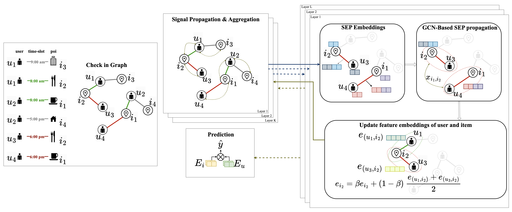

# SEP-GCN: Leveraging Similar Edge Pairs with Temporal and Spatial Contexts for Location-Based Recommender Systems  

This is the code for ICTIR 2025 paper [ SEP-GCN: Leveraging Similar Edge Pairs with Temporal and Spatial Contexts for Location-Based Recommender Systems  ](https://doi.org/10.1145/3731120.3744576)

## Overview
**SEP-GCN** is a graph-based recommendation model that enhances traditional GCNs by learning from **Similar Edge Pairs (SEPs)**—pairs of user-item interactions that are close in **time** and **space**. SEP-GCN augments the user-item bipartite graph with contextual similarity links, enabling long-range information propagation and improving performance, especially in sparse or dynamic environments.

Key innovations:
- **Spatio-temporal edge similarity** modeling.
- **Dual propagation** mechanism via standard GCN and SEP-based edge graph.

## Architecture
SEP-GCN has two main components:
1. **LightGCN-style User-Item propagation**
2. **Edge similarity graph** built from SEP connections

Each layer updates node embeddings using both interaction signals and context-aware SEP edge signals.




## Requirements
The code of SEP-GCN are implemented and tested under the following development environment:
* python=3.11.7
* torch=2.4.0
* numpy=1.26.3
* scipy=1.15.1

## Datasets
We use three benchmark POI datasets:

**NYC** Collected from New York City. Contains user check-ins with timestamps and geocoordinates.  
Focused on urban-level recommendation scenarios.

**Gowalla** A global dataset with users from various cities. Captures diverse temporal and spatial patterns.  
Includes check-ins across multiple time zones.

**Brightkite** Another global dataset with high user activity and coverage across regions.  
Supports evaluation under sparse and dense settings.

All timestamps are converted to local time zones. Users and items with fewer than 10 interactions are filtered out (10-core filtering), ensuring sufficient activity for training and evaluation.

## Usage
```bash
python main.py --dataset gowalla
```

## Citation
If you use this code or our model, please cite:

```bibtex
@inproceedings{sepgcn,
  title     = {SEP-GCN: Leveraging Similar Edge Pairs with Temporal and Spatial Contexts for Location-Based Recommender Systems},
  author    = {Nguyen, Tan Loc and Tran, Tin T.},
  booktitle = {Proceedings of the 2025 International ACM SIGIR Conference on Innovative Concepts and Theories in Information Retrieval (ICTIR ’25)},
  year      = {2025},
  publisher = {ACM},
  doi       = {10.1145/3731120.3744576}
}
```
